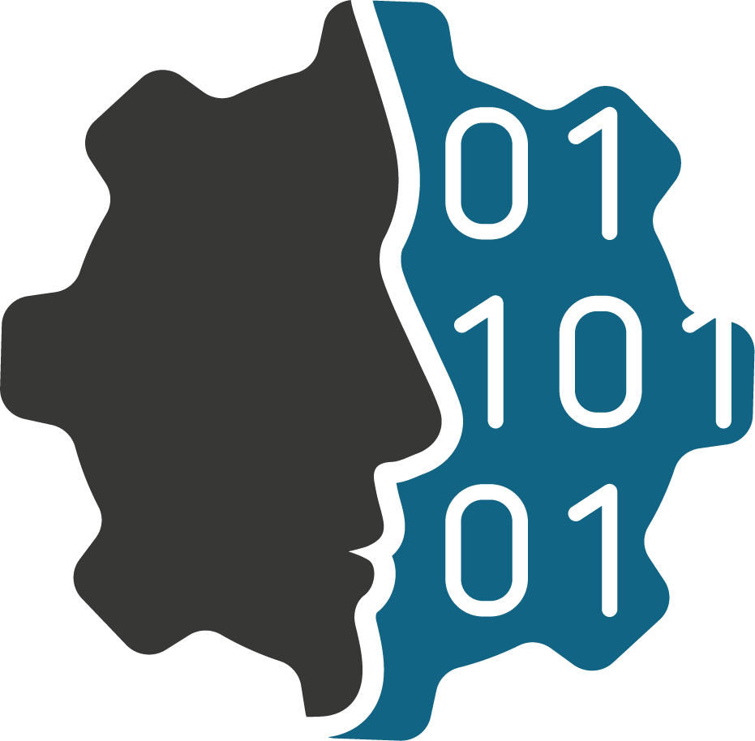

<!-- PROJECT SHIELDS -->
[![IWU][iwu-shield]](https://www.iwu.fraunhofer.de/)
[![Tests][pages-shield]](https://causalgraph.github.io/causalgraph-ontology/)


<!-- PROJECT LOGO -->
<br />
<div align="center">
  
  <h3 align="center">causalgraph ontology</h3>
  <p align="center">
    Ontological description of the relations in the <a href="https://github.com/causalgraph/causalgraph">causalgraph package</a>
    <br />
    <!--<a href="https://github.com/othneildrew/Best-README-Template"><strong>Explore the docs »</strong></a>
    <br />-->
    <br />
    <a href="https://causalgraph.github.io/causalgraph-ontology/">Detailed ontology documentation</a>
    ·
    <a href="mailto:causalgraph@iwu.fraunhofer.de">Contact us</a>
  </p>
</div>


<!-- TABLE OF CONTENTS -->
<details>
  <summary>Table of contents</summary>
  <ol>
    <li><a href="#about-the-project">About the Project</a></li>
    <li><a href="#detailed-ontology-documentation">Detailed ontology documentation</a></li>
    <li><a href="#contributing">Contributing</a></li>
    <li><a href="#license">License</a></li>
    <li><a href="#contact">Contact</a></li>
    <li><a href="#ackn">Acknowledgments</a></li>
    <li><a href="#citing-this-project">Citing this project</a></li>
  </ol>
</details>


<!-- ABOUT THE PROJECT -->
## About the project

causalgraph ontology - TEXT TEXT TEXT


<!-- DETAILED ONTO DOCS -->
## Detailed ontology documentation

A detailed description of the ontology including its classes, properties and axioms can be found at our [GitHub page](https://causalgraph.github.io/causalgraph-ontology/).


<!-- CONTRIBUTING -->
## Contributing

Contributions are what make the open source community such an amazing place to learn, inspire, and create. Any contributions you make are **greatly appreciated**.

If you have a suggestion that would make this better, please fork the repo and create a pull request. You can also simply open an issue with the tag "enhancement".
Don't forget to give the project a star! Thanks again!

1. Fork the Project
2. Create your Feature Branch (`git checkout -b feature/AmazingFeature`)
3. Commit your Changes (`git commit -m 'Add some AmazingFeature'`)
4. Push to the Branch (`git push origin feature/AmazingFeature`)
5. Open a Pull Request


<!-- LICENSE -->
## License

Distributed under the MIT License. See `LICENSE` for more information.


<!-- CONTACT -->
## Contact

- Mail: causalgraph@iwu.fraunhofer.de
- Blog: [https://www.kognitive-produktion.de/?p=3154](https://www.kognitive-produktion.de/?p=3154)
- Project Link: [https://github.com/causalgraph](https://github.com/causalgraph)


<!-- ACKNOWLEDGMENTS -->
## Acknowledgments

The development of causalgraph is part of the research project KausaLAssist. It is funded by the German Federal Ministry of Education and Research (BMBF) within the "Future of Value Creation - Research on Production, Services and Work" program (funding number 02P20A150) and managed by the Project Management Agency Karlsruhe (PTKA). The authors are responsible for the content of this publication.


<!-- CITING -->
## Citing this project

If you find causalgraph useful for your research, please cite us as follows:

Sven Pieper, Carl Willy Mehling, Dominik Hirsch, Tobias Lüke, Steffen Ihlenfeldt. causalgraph - A Python Package for Modelling, Persisting and Visualizing Causal Graphs, Embedded in Knowledge Graphs. 2023. [https://arxiv.org/...](https://arxiv.org/)

DOI: tba.

Bibtex:
```bibtex
@article{
  title={tba.},
  author = {tba.},
  journal = {tba.},
  year= {tba.}
}
```


<!-- MARKDOWN LINKS & IMAGES -->
[iwu-shield]: https://img.shields.io/badge/Fraunhofer-IWU-179C7D?style=flat-square
[pages-shield]: https://img.shields.io/github/actions/workflow/status/causalgraph/causalgraph-ontolog/github_pages.yml?label=GitHub%20pages&style=flat-square


